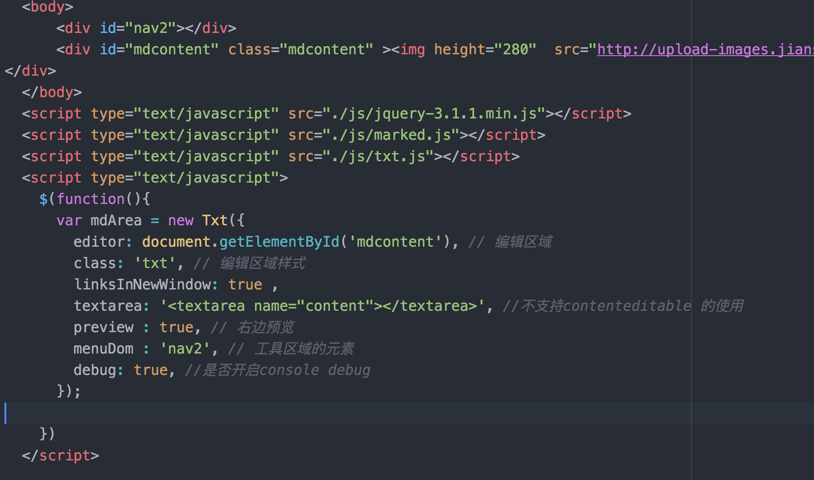

# Txt

### Directly on the preview

### Features

```
Move forward
2. Backward
3. blockquote
4. h1, h2, h3, h4, h5
5. Plain text
6. Ordered list
7. Unordered list
8. Indent
9, bold, down, italic
10. Text links
11. MD View
12. Picture added

```





    $(document).ready(function(){
      var options = {
          editor: document.getElementById('mdcontent'), // Edit the area
          class: 'txt', // Edit the  style
          debug: true, //switch console debug
          textarea: '<textarea name="content"></textarea>', // The use of contenteditable is not supported or not

          linksInNewWindow: true ,
          preview : true, // preview area
          menuDom : 'nav2' // The elements of the tool area
        }
        var editorMd = new Txt(options);
    });


#Txt

新生代  轻量级web富文本框 , 使用简单。


### 功能

```
1.  前进
2.  后退
3.  blockquote
4.  h1 , h2 ,h3 ,h4 ,h5
5.  普通文本
6.  有序列表
7.  无序列表
8.  缩进
9， 加粗，下滑，斜体
10. 文本链接
11. MD 查看
12. 图片添加

```

### 参数解析

$(document).ready(function(){
  var options = {
      editor: document.getElementById('mdcontent'), // 编辑区域
    class: 'txt', // 编辑区域样式
      debug: true, //是否开启console debug
      textarea: '<textarea name="content"></textarea>', //不支持contenteditable 的使用
      linksInNewWindow: true ,
      preview : true, // 右边预览
      menuDom : 'nav2' // 工具区域的元素
    }
    var editorMd = new Txt(options);
});
